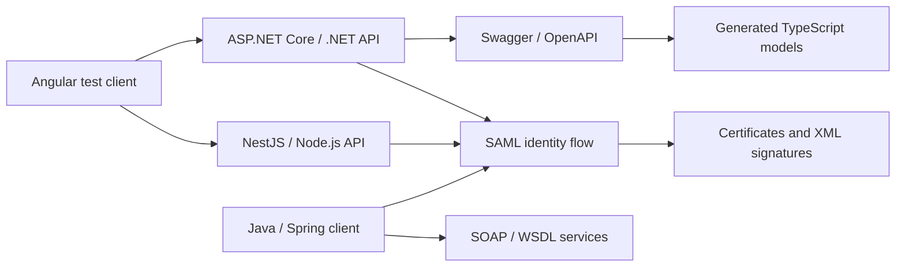

# Architecture Notes

This portfolio case study describes an Nx-based integration lab that compared
several implementation paths for public-sector identity and document workflows.
It focuses on system shape, responsibilities, contracts, validation concerns and
technology tradeoffs.

## High-Level Flow

## Responsibility Split

### Angular Client

The Angular application acts as a visible integration harness:

- trigger authentication and API calls,
- compare responses from backend prototypes,
- preview JSON and HTML/SAML-related responses,
- make callback and error paths easier to inspect during local experiments.

### NestJS / Node.js API

The NestJS track explores a Node-based implementation path:

- controller and service structure,
- SAML-oriented login and callback endpoints,
- DTOs and typed request/response models,
- Swagger documentation for local API visibility.

### ASP.NET Core / .NET API

The .NET track explores a C# backend implementation path:

- API controllers and DTOs,
- Swagger/OpenAPI generation,
- certificate-aware request handling,
- SAML request generation and response processing helpers.

### Java / Spring Client

The Java track is strongest around enterprise integration concerns:

- JAX-WS and Apache CXF clients,
- WSDL-generated service models,
- XML security and signing utilities,
- OpenSAML-oriented request and artifact-resolution flows,
- SOAP document-service interfaces.

## Why This Architecture Is Portfolio-Relevant

The project shows how frontend work connects to deeper integration workflows:

- browser flows depend on API and identity callback design,
- contracts need to be visible and generated where possible,
- older SOAP/WSDL services still appear in real integration work,
- certificate handling and XML signatures require careful debugging habits,
- different backend stacks make different tradeoffs for the same workflow.
